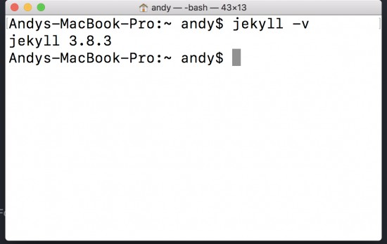

---
Programming is a journey and developers are constantly learning as new technologies are coming out. One of the most popular ways to learn a new technology is through user and community driven content whether it be blogs, youtube, or tutorial sites. It is important for developers to start contributing to or producing informative content early on into their development career so that they can document their own journey and help others who are less knowledgeable on a specific topic out. 
    
Most beginners might want to write a blog but do not have the technical abilities to create a blog website yet. Blogging sites like medium help beginners lower the barrier to entry and let them write blogs without worrying about the technical aspect of publishing their content. However, blogging sites like medium compromises on customizability for convenience. In this blog I am going to show you a very quick and easy way to set up your own blog from a template and host it for free on github pages. Even though you are using a template for your blog, Jekyll allows you full control over the template so that you can customize it to your heart’s content.

# About Jekyll
---
Jekyll is a static site generator. Without going into too much detail, a static site is a site that has all of its code pre-written so that everyone who accesses the site will always get the same site. Most websites now days are dynamic, which means that the site is not pre-written but gets generated on request by the user. 

Static sites have their own advantages and disadvantages, here are a couple of advantages:

1. Faster speed since static sites don't need a server side language.
2. More secure since there are no databases

A couple of disadvantages are:

1. Very limited user experience (no CRUD functionalities)
2. Not DRY(Don’t Repeat Yourself)

Jekyll allows developers to develop their jekyll site dynamically by creating templates, it helps solve the problem of the code not being DRY. There are many templates online that beginners are allowed to use to get started. By using a template, users can focus on the content of the site by writing them in markdown files. When jekyll builds out the website, it combines user content and the template to generate website files ready to publish. This way developers can develop dynamically while publish statically.

# Getting Started
---
### Method 1: Fully Custom
Prerequisites:
* Have ruby installed (comes preinstalled on macs).

* Install the jekyll theme. In the terminal type  `sudo gem install jekyll`. You can check what version of jekyll you have by typing `jekyll -v`.

1. To start a new jekyll blog just type `jekyll new` and then the name of your blog. `jekyll new new-blog`. This should create a folder with your blog name and install all the gems necessary.
2. Your blog will come with a preinstalled theme called minima. If you run the command `jekyll serve`, a server will launch and you will be able to access your site.

3.	**We see that the site is hosted on localhost port 4000, so lets go over and take a look!**

4. Open up your editor on the jekyll blog folder and within you should have some of the following files and directories. If you do not have the following files/directories please create them in your blog folder.

`|-- _config.yml

 |-- _layouts

 |-- _posts

 |-- _site

 |-- css
 
 -- index.html
`
These are the bare minimum files you need to start customizing the site and producing blog content. Lets go through each one of these one by one. 
* _config.yml: This is a YAML file that stores values that can be accessed for your whole site. It is common to see key:value pairs of Name, URL, and theme name. If you have ever worked with JSON files, you can think of YAML as a more human readable and friendlier version of JSON.
* _layouts : This is a directory where it contains layouts for diffrent pages like home, contact, and posts. Everytime we create a new blog, we can tell the blog that it belongs to the posts layout. This will generate html and css files for each blog.
* _posts : This is another directory that contains markdown files with blog content only. This content will then combine with a layout file when jekyll builds a webpage. 
* _site : DO NOT MODIFY ANYTHING HERE(telling you from experience). After you customize your templates and write blog content in the _posts folder, you can run `jekyll build` command. Jekyll will build static html and css files in the _site directory, therefore you should not ever have to modify anything here directly. 
* css : The CSS directory will hold all of your stylesheets for your blog. Jekyll also supports SASS, so feel free to write .scss files in this directory as well.
* index.html is just the homepage of the site.

# Writing a Post
---
Writing posts in jekyll is really easy. Posts are written as a markdown(.md) file. I am currently using prose.io to write this blog. Prose will connect to yopur github and makes editing Jekyll blogs really easy. However, I still recommend having a markdown cheatsheet if you're just getting started with markdown. 

So just a couple of things to get out of the way before you start writing content:

## Naming Convention
---
Jekyll uses a naming convention to identify blog posts. Posts will not be recognized unless the file name is created using the following `year-month-date-{post-slug}.{file-extension}`.

## Front Matter
---
Front matter is what goes on the top of every file in Jekyll. Front matter section is delineated by three hyphens on the top and bottom. What goes in between the top and bottom set of hyphens are key value pairs. Either JSON or YAML data formats are acceptable, however it's better to just stick with YAML since the rest of your data files are written in YAML. 

You can see in the above example of front matter in the above markdown file. We see that the layout key has a value of post, this basically tells Jekyll to look in the layout folder and use the post layout for this particular markdown file. The above is a basic template of what you would want in your front matter, however feel free to add more key/value pairs as you see fit. All of the key/value pairs can be accessed within the blog by using `{{ page.some_value }}` for example `{{ page.date }}` can be used to refer to the date value in front matter inside your markdown blog file. 

# Publishing on Github
---
After we have created our first blog post (or a simple test file) we have to publish it somewhere. Github pages offers free hosting for static sites like our blog that we just built, so I am going to show you how to host your site there. 

Step 1. Create a new repository on Github

Step 2. Go to your terminal and cd into your jekyll directory and type `git init` to initialize git.

Step 3. Type `git add .` to add all your files to git so that they can be commited. Then type `git commit -m "initial commit"` to commit all the files you just added. Then you can connect your local git with your online github repository by using `git remote add origin git@github.com:github_username/repository_name.git` . Last but not least, push your changes using `git push -u origin master`. All your files should now be on github.

Step 4. Next go to your github repository and under the settings change the name of the repository to your_username@github.io.

Step 5. Scroll down on the settings page and make sure that under Github Pages the source is set to master branch. Now to access your blog website you just need to go to your_username@github.io

Step 6. Profit.

