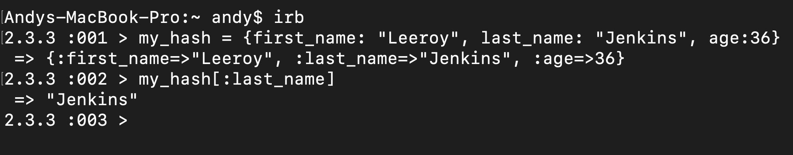
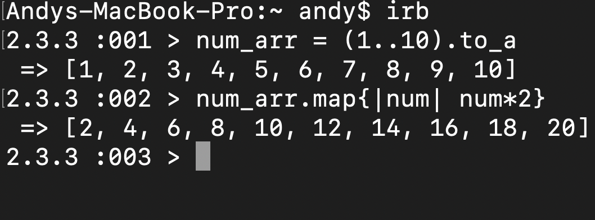

---
If you have spent some time on sites like codewars, leet code, or other various algorithm site. You will see that there are many solutions for the same code problem. How do we know which solution is the best? Is it the solution with the shortest lines of code? The solution that takes the shortest amount of time to execute? How about the one that is more readable? Well the answer is complicated but, the time that it takes to execute can be generalized and be used to compare code. The reason why developers care about the runtime of code is to provide better user experience. According to Kissmetrics, 47 percent of visitors expect a website to load in less than 2 seconds. The following diagram shows the abandonment rate of websites vs the number of seconds a page takes to load.

Okay, so we know that time complexity is important, but how do we quantify it? If you are new to this topic then you might be shocked that time complexity is not actually measured in a unit of time. We have the ability to quantify the amount of time it takes to execute code, so why don't we just time two different solutions and see which one is faster? Well, time that code takes to run is dependent on too many other factors besides the code itself. For example, the time that it takes for code to run on my local machine is different depending on how many apps I have running in the background. Another difference can be seen when the same code is ran on other computers with different specifications. Therefore, timing the code is an unreliable way of determining time complexity.

# Enter the Big O Notation
---
The big O notation allows us to talk about the runtime of code in a fancy/formal way in relation to the growth of the size of the input.It does so by letting us count the amount of simple operations a computer does. This way we obtain a non biased measurement for time complexity since the amount of operations stay constant no matter what computer we are on.

## Accessing a Single Element
---
The simplest case for complexity is when we are retrieving the value for a single element either in an array or a hash. The code below shows a key being retrieved from a hash.

It does not matter if the code above had one key or a million keys, accessing a single key's value will always require a single operations therefore the complexity is considered to be O(1).

## A Ruby .map iterator
---
For the next example let's look at a ruby .map iterator,

As you see in the example, map iterates through the whole array. In the example there was an array with numbers 1 to 10 inclusive, therefore showing 10 operations being done on the original array. If the size of the array was given a variable n (num_arr.length = n), then it would take n number of operations in order to get the result. Thus, the .map iterator in ruby will have a time complexity of O(n).

# Example Problem Time!
---
 
