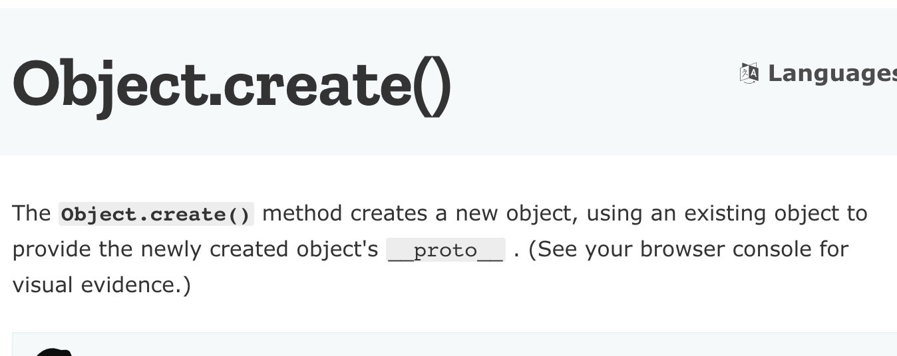
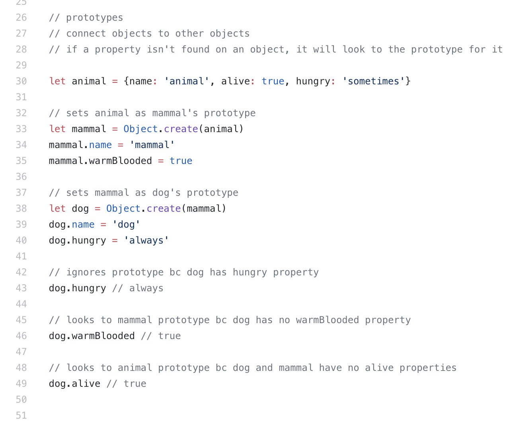

## Class Inheritance vs Prototype Inheritance
Starting flatiron bootcamp, I learned about Object Oriented  Programming in Ruby in the first 6 weeks.  After, Ruby, our cohort started learning about Object Oriented Programming in Javascript. However, there was something very different about OOP in Javascript. Creating the same app in using OOP javascript took a noticeable amount of more work to do the same thing in OOP Ruby.I had a lot of trouble understanding it until I discovered the class syntax in ES6. ES6 classes provided a way to abstract away all the prototype shenanigans going on behind the scene. The basic concept of inheritance is to share and reuse code, Ruby and Javascript just do it in a different way.

## How Ruby Does Inheritance
Ruby uses something called the Classical inheritance, where classes are a special type of object that can initialize and create instances. These classes act as a blueprint for the instance and creates a parent/child relationship implicitly. This type of relationship creates a hierarchy and that hierarchy might not be a problem at the time of writing your code. However, as your application grows and is being maintained, having a hierarchy relationship limits what you can do with your code. For example, let's say you have a human class that has many different instances of different people with attributes of hair color and methods of eat(), sleep(), and walk(). You also have another class called robots that create instances that have attribute of metalType, and methods of shootLazer(), and drive(). Lets say that later down the line you want to create a cyborg class and you want the cyborg to be initialized with a walk() and hairColor from the human class, but you also want metalType and shootLazer() from the robot class. This is a very basic example when you can run into problems in class based OOP.

## How Javascript Does Inheritance

Javascript on the other hand uses prototypal inheritance and is different from class based inheritance in Ruby even though many people try to mimic class based inheritance in Javascript. In prototypal inheritance, instances inherit from other instances. According to Kyle Simpson the author of ‘You Dont know JS’, its literally Objects linking to other objects. Its basically just copying properties from one object into a new instance. This takes away the problem of the implicit hierarchy that is created by Ruby.  Every object in javascript has a reference to another object called the prototype.

The following shows how to set prototypes to a new object and after that is an es5 implementation example of prototypes from my mod 3 lead instructor Niky.

mdn snippit describing Object.create();

As you can see there is an animal object and its being passed into mammal's prototype so that it allows mammals to have animal methods and attributes. However, one thing that I would like to point out is that it looks like mammal is inheriting from animal, but keep in mind that its actually just sharing properties. There is no Has-a  or a is-a relationship.

## Conclusion
Until the introduction of “real” classes in ES6, the whole concept of inheritance was messed up and (usually) taught in a wrong manner. Prototypes are more of a delegation tool and they don’t really behave like classes. Now with the abstraction provided by ES6 we can write class inheritance between different classes without any problems, but a solid understanding of prototypes can help you unlock more than what class inheritance gives you.
