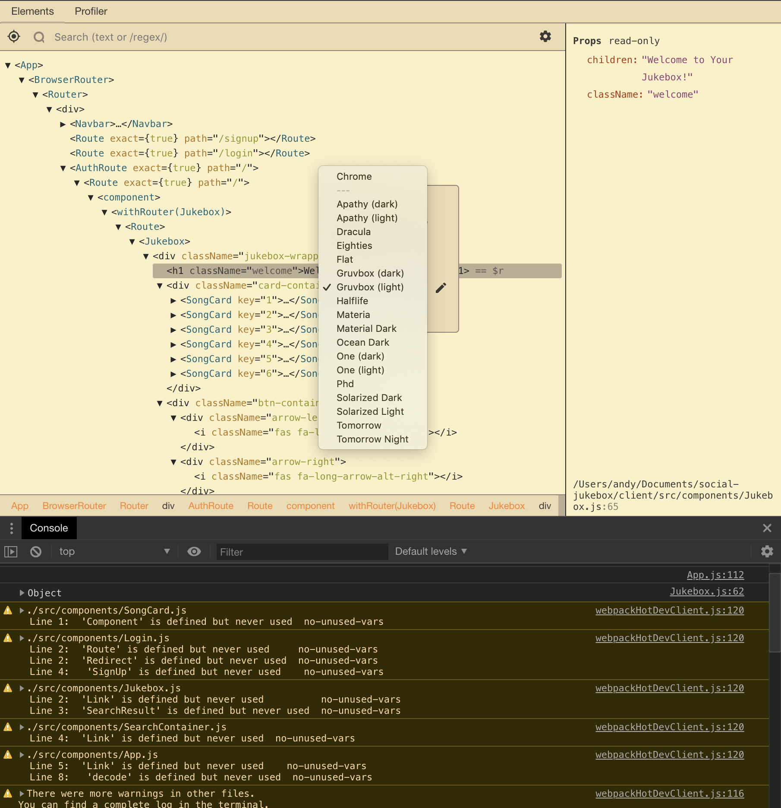
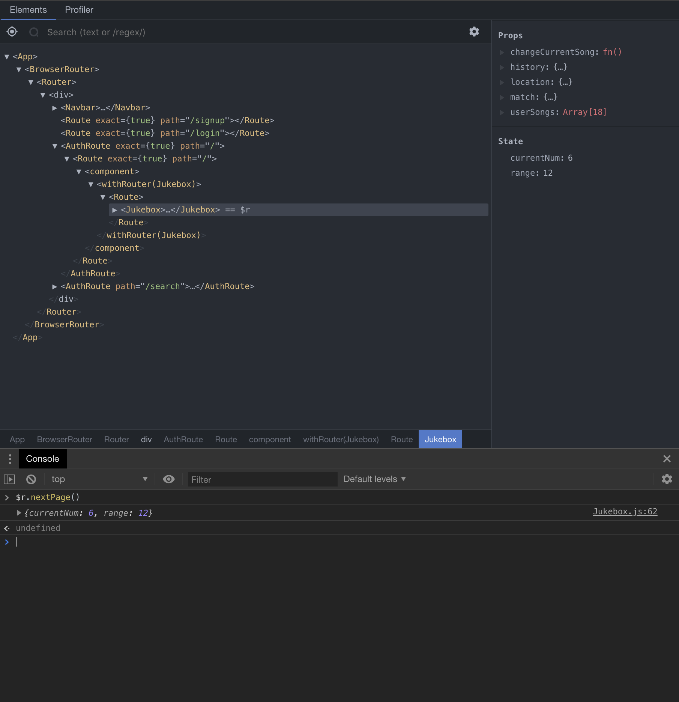
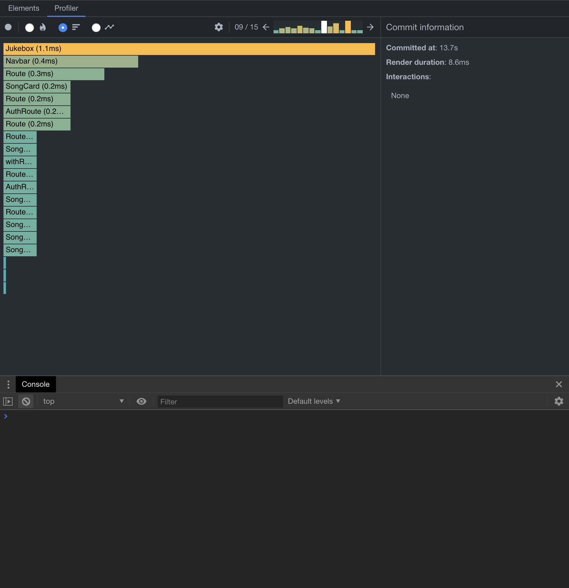

## Chrome Dev Tools
As Web Developers, most of us are familiar with the chrome developer tools that come built in with the chrome browser. The dev tools have been very helpful in debugging in javascript's debugger mode, checking class names on DOM elements, or just using the console as a javascript playground. I only named a few features of the chrome dev tools, the feature is complicated and there is somewhat of a learning curve when getting started with it. Not to add to the complication but there is actually an extension to the chrome dev tools that works specifically with React, and that is what this blog is going to dive into.

## What Even is a Virtual DOM?
When we open up the elements tab on the chrome dev tools, we actually see the DOM that the browser is producing for our users. However, in React there is something called the virtual DOM, which is a copy of the actual DOM. React developers use javascript to interact with the virtual DOM instead of the actual one. When any changes are spotted between the DOMs, an update occurs. So if developers are actually manipulating the virtual DOM, wouldn't it be nice to see it? Well you can with the react devtools.

The above picture shows the recent Jukebox project I built with react, as you can see the react components are all shown in a tree just like the actual DOM with elements.  The right side of the virtual DOM tree you can see the props and state for the current component selected. There is also a search bar at the top for you to quickly look for components or elements. Next to the search bar there is a finder which is acts just like the one you would find on the top left of your regular chrome developer tools. The finder lets you play around with your actual page and helps point you to the right component inside the react dev tools. On the bottom bar you can also see a component/element hierarchy which tells you which component or element renders each one directly.  There is also a setting button on the right that you can click to change your theme for the react devtools if you're into that.

## ==$r... more like $r = '?'

So far you might be thinking, that this is cool and all but how do I actually interact with this virtual DOM inside of the dev tools? Well, we can actually use the built in console that chrome gives us to play around with components. If you click on any component, you will see a small == $r next to it. What is this $r? Well it's basically whatever you select on the virtual DOM, because it changes when you click on a different component or element. What you can do is select a component and type $r into the console and it should return back the component.

So, in the photo above I have a function called nextPage on my jukebox that allows a user to flip to the next page via an arrow button. However, inside the react devtools I can select my Jukebox component so that i can access it using $r in my console. Then I can invoke the next page function on my jukebox without ever having to actually press the arrow button to fire off the event listener.

## Last and kinda least(for small apps)... The Profiler Tab
The last thing I want to talk about is the very recent addition of the Profiler tab and that developers can use to generate flame charts. Flame charts basically lets you see the performance of your app. Which then you can use to see at what places is your app slowing down the most so that you can optimise your app.

To start gathering data you can hit the record button on the top left. While recording, mimic a typical user and go through some actions inside of your app. After you're done mimicking, press the stop button and then you are presented with the flame charts. On the top right you can see the number of renders recorded and you can scroll through each one to see the performances of all your components affected by the renders.

What I like to do is use the flat rank button on the top of the devtools and just look at which component took the longest to render while flipping through each render. If one seems out of place I can then double click on the component and it show up a more detailed page that includes all the props that were involved.

Even though this blog does not go in depth about the react devtools, it should help you get started with them. As programmers we all know that the best way to learn is just to play around with just enough information to shoot ourselves in the foot. However, whatever happens inside the dev tools will never touch your code ;). So go forth and explore!
