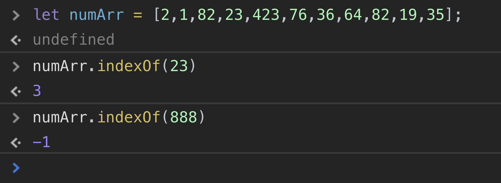
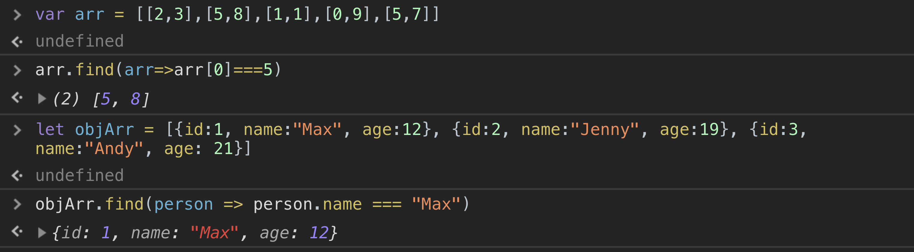
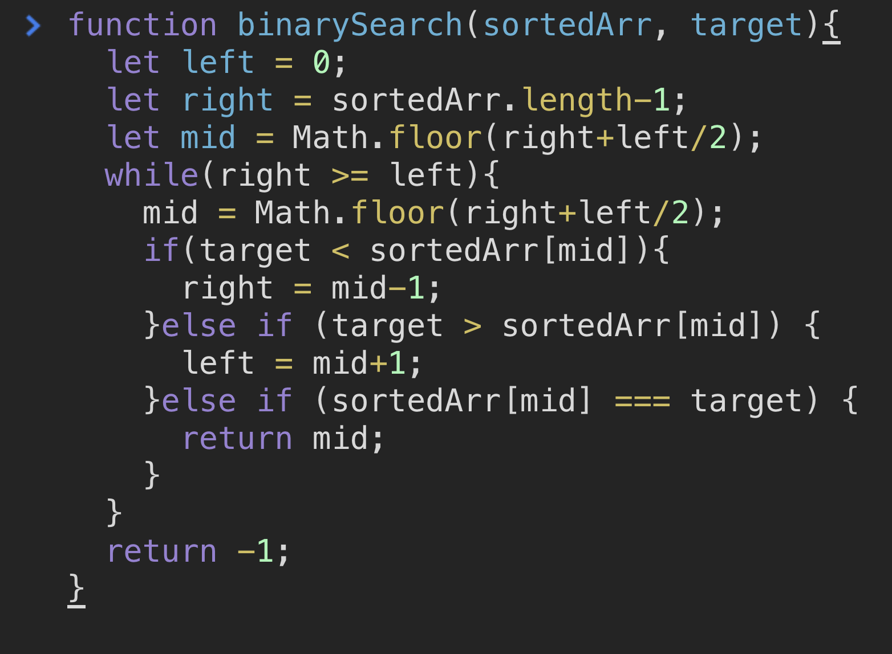

As a web developer without a traditional computer science degree, I struggle a lot when it comes to algorithms. With popular front end frameworks like React, a lot of code that I find myself writing nowadays are more declarative rather than imperative. Therefore, the code is more human readable and less verbose due to the higher levels of abstraction. Higher levels of abstraction comes with a cost of not fully understanding how a computer processes and interprets lines of code. Common algorithms are however, important to understand and should be in every developer’s tool belt since there is not always an abstraction for the most efficient solution in every situation you will run into. In this blog I will explore searching in Javascript. We will cover searches across an unordered array using existing javascript methods and their run times respectively then I will introduce the binary search algorithm to search on an ordered array.

## Unordered Searches in Javascript
In many common algorithms in computer science, there is usually a naive solution which is inefficient and then there is a correct/more time efficient way that does not seem obvious at first. However, when searching through an unordered array, the obvious solution is most likely the correct one. The time complexity of looping through an array comparing the value at each index vs the target value is O(n). Now you might be thinking that there has to be a better way, but a linear time complexity is really not that slow. The chart below will show you the having a linear time complexity is fair.

Okay, so now let’s look at searching methods that come out of the box for free with javascript. These will all have have a linear time complexity.

### indexOf ###
In Javascript indexOf is a method that can be used on either a string or an Array to find the index of a specific element. If the element is not found inside the array or string, then the method returns -1. The function takes in two arguments, the first being the element in which you are looking for and the second is an optional argument of what index to start at(the default is 0). The following is a basic example of how this works.

There is one caveat when using indexOf. The method indexOf does not work when the array using the method contains values that are pass by reference. Essentially the array can only have primitive values like numbers, strings, booleans, etc. There is however a more powerful method that can be used to find an object or arrays inside an array of objects/arrays that we will take a look at next.

### Find
The find method in javascript is applied to arrays and takes in a callback with three arguments, the element, the index of that element(optional) and the array itself(optional). The find method return the first element that returns true inside the callback function. This is different from indexOf in that it returns the element and not the index. Below is an implementation of the find method on a 2d array and an array of objects.

### Other Methods
There are two more methods that I will mention but not show examples of. One is the .includes method, which can be called on an array or string. The return value of the includes method is a boolean which tells you if the value passed in exists in the array or string. The last unsorted method is findIndex, which is an array method that takes in the same parameters as .find(). However, instead of returning the element that is found, the method returns the index. Next, we will look at a binary search in javascript, which is more interesting since there is not a method in javascript that does it for us.

## Ordered Search in Javascript ##
Imagine this scenario, if I were to hand you an old school dictionary and asked you to find the word “Panda”, how would you look for that word? You would probably open the dictionary at about 70ish percent of the way towards the end since the letter p is at the end of the alphabet and then you would look at the first word on the page and the last word. Then what you would ask yourself “is the letter p before or after the letters/words I see on that page?”,  then you would make your next move based on the answer to that question either going forwards or backwards in the dictionary. This is roughly the same logic used when implementing binary search in programming. Notice how the data has to be sorted or else this method would not work. Before we start talking about the time complexity of binary search I want to show you how it works first so that the runtime will make more sense.

### Binary Search ###
Now before we begin, I want to say that there is really nothing stopping you from using any of the previous methods to find and search an array using predefined methods that javascript gives us out of the box. However, when your data is sorted and if you have lots of data, it might be worth it to implement a binary search even if you have to implement it from scratch. So, let's imagine a scenario where we have a sorted array of numbers and we are looking for the index of a specific number. Binary search works by doing the following:
Create 3 pointers, one at the beginning indicating the minimum, one in the middle indicating the middle value, and then one at the end indicating the maximum value.
Check if array[middle] is equal to the target value, if so return the middle pointer value.
If the target is less than the middle value, make the max/end pointer equal to the mid and recalculate the mid based on the new max value. Same logic if the target is less than the middle value except you would move the left/min pointer to the mid and then recalculate the mid based on the new position of the pointer.
If however, the target value does not exist in the array, return -1.
This is a simplification of binary search but the above steps are the main ideas in implementing it. You still need to be careful to implement the correct base case or else you might be stuck in an endless loop. So enough talking let's take a look at what it looks like written in javascript.

So the reason why we add/subtract one value from the mid value is because we already know that the mid value is not the target from the if statements. Therefore it would be redundant to include the mid values. Now the base case is just checking and making sure that the min and max pointers don't overlap and if the two overlap, the loop breaks and -1 is returned. So we know that binary searching is faster when you have a sorted array, but how much faster? Let’s look at that part next.

### Binary Search Runtime
The time complexity of binary search is O(log(n))  (log based 2 of n). Let’s demystify this by thinking for a moment on how binary search works. Everytime we look at the mid point and compare the value there to the target value, then making the next move, we are essentially discarding the other half of the array. Therefore, if we double the initial size of the array, it would only be one additional operation for the worst case scenario in finding the index. When we double something we can say we are raising the number 2 to the next power. For example 2^3 = 8 and then 2^4 = 16. To double we can just add one to the exponent.So hopefully we can see that 2 to the power of (numberOfOperations) = (arrSize). If we solve the equation to isolate number of operations, we get (numberOfOperations) = log2(arraySize) since logarithms are the inverse of exponents just like how division is the inverse of multiplication. Hopefully that helps makes sense.

## Recap
	So in this blog post we took a look at the different javascript methods, that help us search through an unsorted array and also a faster algorithm for when the array is already presorted for us. As a web developer without a traditional CS background, I have always resorted to using predefined javascript methods for searching without much thought. It was only until recently I started to dive into algorithms and see their value since not every method in javascript is optimized for the best performance in all situations.
