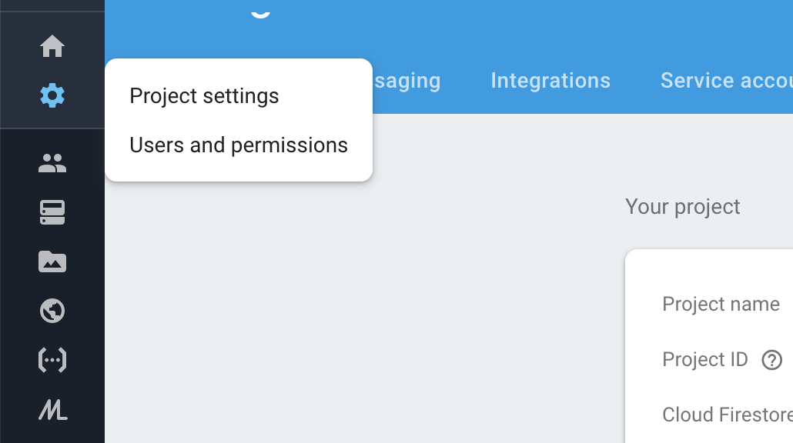
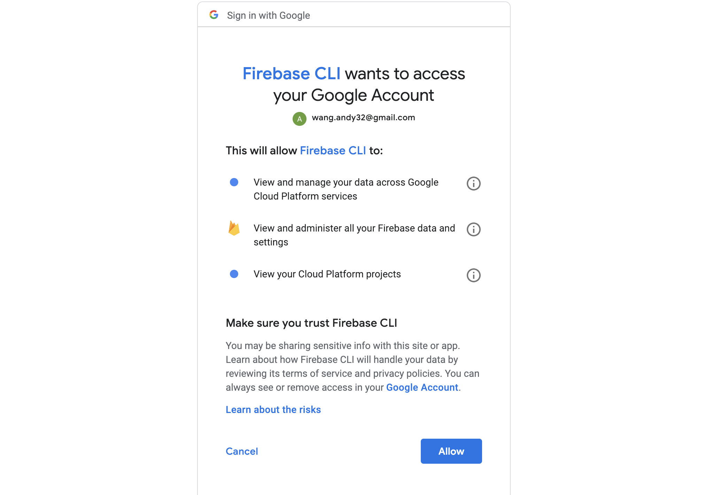
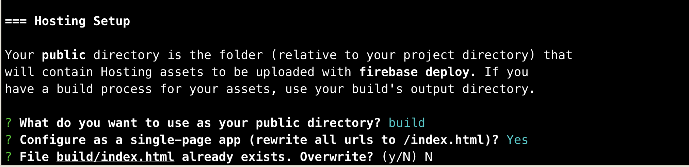
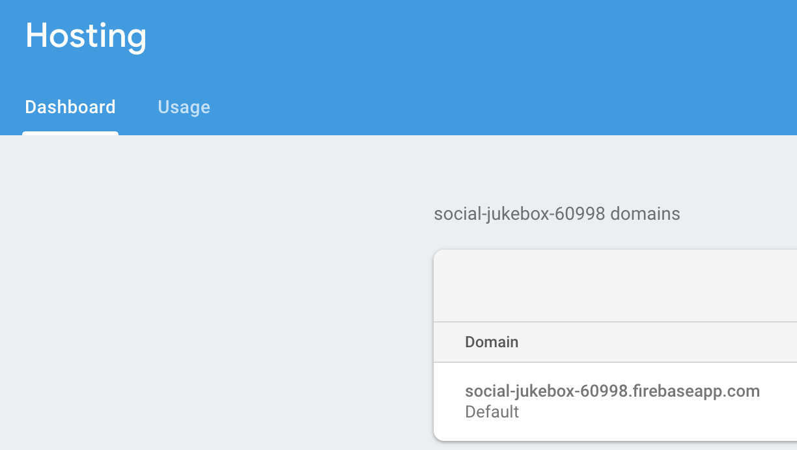

---
So, are you a developer who wants an easy way to deploy your front-end React application? After deploying my front-end projects through various methods including FTP to traditional servers, Github Pages, and Heroku. I have found that the quickest and easiest way to deploy a React app is through Google’s Firebase platform. Firebase is a mobile and web development platform that has many features for developers. They are typically known for their realtime non-relational database, however they have many other features like OAuth, File Storage, and what we are gonna be focused on today, hosting. One nice thing about Firebase hosting is that unlike Heroku, you do not need a backend server to serve your production build. Firebase does have a free plan for hosting which lets you host up to 1GB of files and also 10GB of transfer data per month and afterwards its pay as you go. You also get a free SSL certificate for custom domains. Sold yet? Either way, let's get started.

# Getting Started
---
Prerequisites:
* Have Node installed(if youre developing in React, you have Node).

* Have a React project created with create-react-app boilerplate.

## 1. Create an Account on Firebase

Head over to https://firebase.google.com/ and create your account. After creating your account, you have access to your Firebase console where you can create a new project. Go ahead and create a project in your Firebase console.

## Step 2. Install Firebase Tools and Log in.

After creating your account and project on Firebase, we need to install the firebase tools through our terminal. Run the following command:
`npm install -g firebase-tools`.
After the tools get done installing, you need to login to your google account. To log in, in the command line run `firebase login`. The login command should open your browser window where you can then allow access of your account to the Firebase CLI.

After you log in, feel free to close the browser window and move over to command line and change into the directory of your React project.

## Step 3. Create the  Build Folder For Your Project.
Assuming that your project is made with the create-react-app template, the next step is to set up the production build of your project by running the command `npm run build`. This command will create a build folder that contains static files which you can then use to host. The code inside those static files are still the code that you wrote, but it's transpiled with Bable so that JSX is converted to Javascript and it also makes sure that ES6+ code is compatible with older browsers. There are also extras added to the static files depending on your Webpack configurations.

## Step 4. Initiate Firebase
After you have your build folder, in the command line run `firebase init`. Scroll down to the hosting option and press the spacebar and then enter key to proceed. Okay so now Firebase should be asking you which project you want to deploy your code into. You want to pick the project that you created earlier in the Firebase console. If the project that you created is not showing up there, just select the create a new project option and I will show you how to change to the correct project in the next section of this blog. So now Firebase is going to ask you 3 questions and just use the same responses as I did below.

The responses are pretty straightforward, we want to host from our build folder because that is the folder we just created with production ready code. The part with the index.html overwriting is a bit weird but you have to No otherwise firebase is going to create an index.html and overwrite the one that you have in the build folder (I learned the hard way.).

### Don’t See Your Project?
If you don't see the project that you created on the Firebase console in your command line interface then you just have to run the command `firebase add <project id>` without the angle brackets. You can find your project ID here in firebase.

## 5. Deploy the site
If you successfully initiated Firebase for your project, you should be able to deploy the site with the command `firebase deploy`. There you go, you should be able to find the link to your site under the hosting tab in Firebase.

# Conclusion
---
Pretty easy right? You most likely could have figured this out by looking at the docs, but i'm sharing this info for awareness. I want to also mention that you can use REStful routes with React router in your projects without a problem when deployed with Firebase. When serving static React files from a server or GitHub pages, it throws a 404 when you try to go to another route other than the root in a SPA (unless you use hash router). I also find this method of deployment better than Heroku since Heroku goes to sleep on you if your site has no visitors for an hour, however platforms like Heroku are still necessary if your app has a backend API. Overall, i'm really happy with Firebase and the level of abstraction it provides when deploying. Firebase saves me a headache by not having to worry about the intricacies of deployment and lets me focus on building apps.
